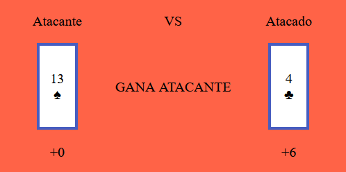
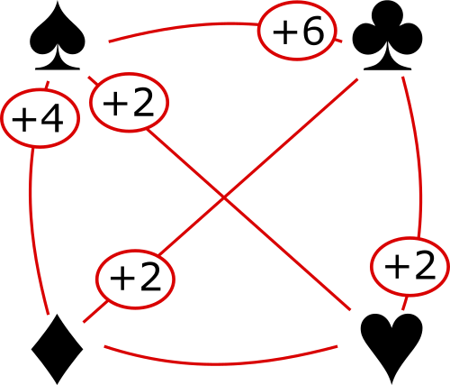

# BattleCard

**Yu-Gi-Oh! Trading Card Game based game using decks of english cards.**

Juego de cartas basado en Yu-Gi-Oh! Trading Card Game usando cartas inglesas.

# Contenido del artículo
- <a href="#juego">El juego.</a>
- <a href="#screen-capture">Capturas de pantalla.</a>
- <a href="#development">Desarrollo.</a>
- <a href="#reference">Referencia.</a>

<h1 id="juego">El juego</h1>

## Requerimientos
Se requiere de 2 jugadores ingresando a la url para iniciar el juego. En distintos dispositivos ó pestañas de navegador.

## Interfaz de juego
La interfaz está compuesto de 3 lados: la sección de jugadores, zona de juego y zona de botones

### Sección de jugadores

Indica los nombres de los jugadores, el número de cartas que tienen en su deck y el jugador en turno.

### Zona de juego

La zona de juego se dividirá en 2 lados (1 para cada jugador).
Cada lado de un jugador está dividido en 3 partes: zona de batalla , cartas de barrera (5 espacios) y cartas en mano.

La zona de batalla (3 espacios) será el lugar donde el jugador colocará cartas para atacar o defender.

Las barreras (5 espacios) representan nuestro numero maximo de  ataques directos/indirectos que podemos recibir en el juego.

Las cartas en mano (5 espacios) son las cartas que podemos colocar en la zona de batalla.

### Zona de botones

En esta sección se mostrarán botones para atacar, defender, colocar, terminar turno, etc; según la necesidad.

## Inicio del Juego
- Cada jugador tendrá una baraja inglesa de 52 cartas.
- Las barajas son ordenadas aleatoriamente.
- A partir de la baraja de cada jugador se extraerán 5 cartas y se colocarán boca abajo como cartas de barrera (en color marron).
- Se extrae 5 cartas mas de la baraja de cada jugador para su mano de juego inicial.
- El jugador que entró a la sala en primer lugar tendrá el primer turno.

## Turno de juego
Antes de realizar alguna acción si el jugador tiene un espacio vacio en su mano recibirá una carta de su baraja siempre y cuando queden cartas en la baraja.

Durante cada turno el jugador puede colocar cartas en zona de batalla (para defender o atacar), atacar cartas de su contrincante, cambiar la posición de batalla de una de sus cartas (ataque o defensa). 

### Colocar carta en tu zona de batalla
- Seleccionar una carta de tu mano.
- Click en el botón "de ataque" ó "de defensa" de la zona de botones, segun se coloque la carta en ataque o defensa.
- Seleccionar una posición vacia en tu zona de batalla.

### Atacar carta en zona de batalla enemiga
- Seleccionar una carta en tu zona de batalla.
- Click en el botón "Atacar carta" de la zona de botones.
- Seleccionar una carta en la zona de batalla enemiga.
- Se visualizará el resultado del ataque. Indicando el ganador, el bonus de ataque/defensa y si se destruye una barrera como producto del ataque.

**Bonificación de ataque/defensa**

Bajo cada carta, tanto de atacante como atacado se visualizará una bonificación que afecta a las cartas segun los palos de la baraja que se enfrenten.

Segun el grafico visualizado: cuando una carta del palo de espadas se enfrenta a un carta del palo de treboles, la carta de trebol recibirá una bonificación de +6 a su valor de ataque/defensa en este caso defendiendo como una carta de valor de ataque 10.

El grafico siguiente resume todas las posibilidades de bonificación de ataque al enfrentarse cartas de diferentes palos

### Cambiar posición de una carta en tu zona de batalla
- Seleccionar una carta en tu zona de batalla.
- Click en el botón "Cambiar posición" de la zona de botones.
- La carta cambiará a posición de ataque o defensa segun la posición previa.
- **Cuando el jugador contrario coloca una carta en posicion de defensa tu veras la carta oculta (de color negra y no sabrás el valor ni palo de la carta). Cuando esta carta es ataca o el dueño cambia su posición a ataque podras ver la información de la carta**

### Terminar Turno
Finaliza el turno actual y le pasa la posta al contrincante

## Fin del juego

El juego termina bajo cualquiera de las siguientes condiciones:
- Un jugador se queda sin cartas de barrera (derrota para el jugador)
- A un jugador no le queda en su baraja mas cartas que colocar en su mano al iniciar su turno (derrota para el jugador).

<h1 id="screen-capture"></h1>

## Bienvenida

## Ingreso a Sala

## Sala de espera

## Juego

## Fin del Juego

<h1 id="development">Desarrollo</h1>

Este proyecto hace uso de Node.js para mejor manejo del proyecto.
- Sección separada para manejo de variable de entorno.
- Bundelizado de proyecto.
- Posterior migración a Typescript (recomendado para proyectos de este tamaño).

Por supuesto de los estandares de la web (HTML,CSS, JS).

Este proyecto hace unas pequeñas implementaciones de web components, con el estandar [Web Components](https://developer.mozilla.org/es/docs/Web/Web_Components) a modo de prueba.

Este proyecto está dockerizado.

[Lista de implementaciones/pendientes](docs/issues.md)

<h1 id="reference">Referencia</h1>

[Yu-Gi-Oh!_Trading_Card_Game - Wikipedia](https://en.wikipedia.org/wiki/Yu-Gi-Oh!_Trading_Card_Game)

